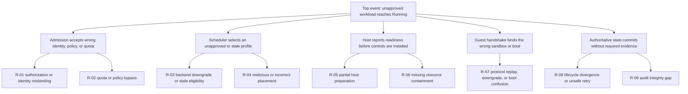
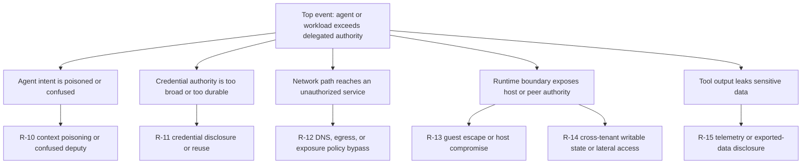
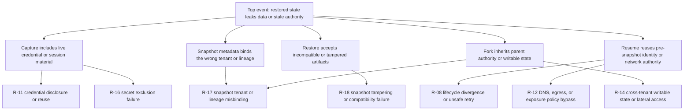
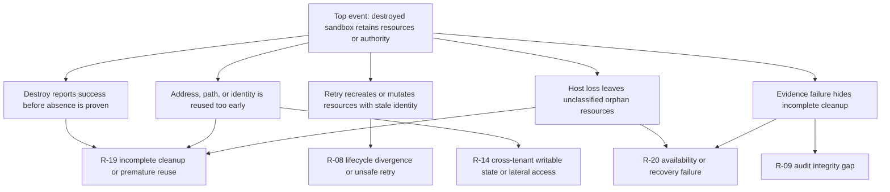

# Capsule Threat Model

**Status**: Proposed
**Date**: 2026-06-11
**Milestone**: M1 - Threat Model and Baseline Controls
**Normative posture**:
[ADR-0006](../adr/0006-production-security-posture-for-sandbox-isolation.md)
**Side-channel assessment**:
[side-channel and covert-channel risk assessment](side-channel-assessment.md)

## Purpose

This document defines the production risk model for Capsule. It identifies
what Capsule protects, who or what can cause harm, where trust changes, how
high-impact failures can occur, and which preventive, detective, and recovery
controls are required.

The model treats security as dependable operation in the presence of:

- malicious tenants, workloads, dependencies, and external services
- confused or compromised agents acting with delegated authority
- honest operator and configuration mistakes
- random software, hardware, network, and storage failures
- organizational failures such as weak review, stale ownership, or missing
  response capability
- distributed-state faults such as stale decisions, identity misbinding,
  non-convergent lifecycle state, and unsafe retries

This document elaborates ADR-0006. It does not lower its isolation floors,
hard invariants, or launch gates. A conflict is resolved in favor of the
stricter requirement until architecture and security review updates both
documents.

## Scope

The model covers:

- public API admission, authentication, authorization, quota, and policy
- regional and cell scheduling, lifecycle ownership, and reconciliation
- host agents, `sandboxd`, privileged helpers, runtime adapters, and VMMs
- host/guest protocol, guest agents, and tenant-controlled processes
- image build, signing, distribution, verification, and promotion
- per-sandbox networking, DNS, egress, ingress exposure, and gateways
- credential mediation, delivery, use, revocation, and telemetry handling
- workspace, snapshot, resume, fork, cache, retention, and deletion paths
- audit evidence, telemetry, operator access, incident response, and recovery

Provider internals, tenant application security, and downstream service
authorization are outside Capsule's direct implementation boundary. They
remain dependencies and are represented where their failure changes Capsule
risk.

## Analysis Method

Capsule combines four views:

1. Top-down risk trees identify combinations that produce high-impact
   lifecycle outcomes.
2. Bottom-up failure mode and effects analysis identifies component and
   interface failures.
3. Abuse-case analysis covers intentional misuse and confused-deputy paths.
4. Residual-risk analysis records what remains after required controls.

Risk identifiers are stable. New risks receive new identifiers; existing
identifiers are not reused after retirement.

### Rating Scale

| Dimension | Values | Meaning |
|---|---|---|
| Severity | Critical, High, Medium, Low | Maximum credible impact before controls |
| Likelihood | Likely, Possible, Unlikely | Expected feasibility and exposure for the defined profile |
| Detectability | Low, Medium, High | Probability that current evidence detects the failure before material harm; low is worst |
| Priority | Critical, High, Medium, Low | Required treatment priority after considering all three dimensions |

Critical and high risks are production blockers unless an explicit ADR-0006
launch gate prevents the affected profile or a versioned residual-risk record
accepts the exact scope.

## Protected Assets

| Asset | Security properties |
|---|---|
| Tenant code, workspace, input, output, and snapshot data | Confidentiality, integrity, tenant binding, retention, deletion |
| Tenant and platform credentials | Confidentiality, narrow scope, short lifetime, revocation, non-persistence |
| Sandbox identity and lineage | Uniqueness, tenant binding, freshness, non-reuse, traceability |
| Lifecycle and policy state | Authorized transitions, freshness, convergence, idempotency, auditability |
| Host kernel, devices, filesystems, processes, and management sockets | Isolation from workloads, integrity, availability, recoverability |
| Runtime, guest, image, and helper artifacts | Provenance, integrity, compatibility, vulnerability status |
| Network policy, DNS decisions, egress, and port exposure | Default denial, attribution, lease binding, revocation |
| Quota, scheduler capacity, and placement decisions | Integrity, fairness, availability, isolation-floor compliance |
| Audit events and validation evidence | Completeness, ordering, immutability, retention, queryability |
| Control-plane and compute-plane administrative authority | Strong authentication, least privilege, separation of duties, accountability |
| Platform availability and recovery capability | Bounded failure, safe degradation, rebuild, rollback, incident response |

## Actors and Failure Sources

| Actor or source | Capabilities and motivation |
|---|---|
| Malicious tenant workload | Executes arbitrary guest code, probes boundaries, consumes resources, manipulates protocols, and attempts exfiltration or persistence |
| Compromised or confused agent | Uses legitimate tools and credentials with poisoned context, excessive scope, or incorrect resource identity |
| Malicious tenant administrator | Configures images, policies, tools, egress, and exposure within tenant authority and attempts to exceed it |
| External attacker | Targets public APIs, exposed sandbox ports, dependencies, registries, storage, and operator identities |
| Compromised dependency or artifact producer | Introduces malicious code, vulnerable packages, forged metadata, or unsafe updates |
| Platform operator | Performs powerful administrative actions and can make honest mistakes or abuse granted authority |
| Malicious or compromised insider | Uses legitimate platform access to alter policy, placement, artifacts, evidence, or recovery behavior |
| Control-plane or host component defect | Produces stale, duplicated, reordered, partial, or incorrectly bound operations |
| Infrastructure failure | Causes process crash, host loss, network partition, storage corruption, clock anomaly, or resource exhaustion |
| Organizational failure | Leaves controls unowned, reviews incomplete, alerts unactionable, exceptions expired, or recovery untested |

## Assumptions

The production model assumes:

- public workloads can be malicious before admission or compromised later
- tenant administrators are trusted only within explicit tenant authority
- guest root is not host authority
- platform components, operators, and build systems can fail or be
  compromised
- network location, process location, and prior success are not identity
- cryptographic primitives and the configured hardware virtualization
  mechanisms behave according to their reviewed security properties
- the cloud and hardware provider protects physical facilities and underlying
  service control planes according to the selected deployment contract
- a secret observed by workload code must be treated as disclosed to that
  workload
- application memory can contain tenant-copied secrets that Capsule cannot
  reliably identify
- telemetry can be delayed or lost, while authoritative audit events must
  satisfy the separate durable contract in ADR-0009
- prevention is required for ADR-0006 hard invariants; monitoring is not a
  substitute

Capsule does not assume:

- that a microVM alone provides a complete production security posture
- that internal traffic, private addresses, or same-tenant placement is safe
- that tenant-declared trust permits a weaker isolation floor
- that encryption makes captured credentials safe to restore
- that retries are safe without operation identity, fencing, and idempotency
- that an operator command is correct merely because it is authenticated
- that a successful functional test proves a security boundary
- that shared-host side channels are acceptable before approval

## Security Objectives

Capsule must:

1. Preserve the approved isolation floor for every workload and reject
   placement rather than silently weaken it.
2. Bind every protected action to current tenant, sandbox, operation, policy,
   lease, boot, and resource identity as applicable.
3. Prevent guest access to host, platform, other-tenant, and stale-generation
   authority.
4. Make network reachability and port exposure explicit, scoped, time-bound,
   attributable, and revocable.
5. Keep credentials short-lived, least-privilege, non-ambient, and absent
   from persistent artifacts and unsafe telemetry.
6. Preserve tenant, lineage, integrity, compatibility, and freshness across
   snapshot, resume, fork, and deletion.
7. Bound resource consumption and control-plane work before untrusted
   execution starts.
8. Reject stale, duplicated, reordered, misbound, or partially completed
   distributed operations.
9. Produce durable evidence for security-sensitive decisions and make
   evidence gaps operationally visible.
10. Recover through revoke, quarantine, drain, rebuild, restore, rollback,
    and incident response without relying on compromised workload cooperation.

## Trust Boundaries

| Boundary | Untrusted side | Trusted side and required checks |
|---|---|---|
| Public client to API | Client identity, input, retries, trace context | AuthN, AuthZ, schema bounds, idempotency, quota, policy, audit |
| API to regional services | Service request and propagated context | Mutual service identity, typed authority, deadlines, current policy and operation identity |
| Regional to cell control plane | Assignment, desired state, evidence references | Authenticated assignment, fencing epoch, version, expiry, backend and profile constraints |
| Cell to host agent | Host command and placement identity | Host identity, capacity, health, assignment freshness, replay rejection |
| Host agent to `sandboxd` | Lifecycle intent and resource request | Local peer identity, typed bounded operations, serialization, durable receipts |
| `sandboxd` to privileged helper | Network, mount, cgroup, device, or snapshot intent | Narrow typed interface, exact resource paths, kernel peer credentials, no shell input |
| Runtime process to host | Guest-triggerable VMM and kernel surface | VM boundary, jail, namespaces, seccomp, capabilities, cgroups, minimal devices |
| Host to guest agent | Protocol messages and stream content | Fresh boot secret, mutual authentication, bounded framing, version and identity binding |
| Guest agent to tenant process | Commands, files, mounts, output, signals | Tenant workload contract, least privilege, path and size validation, process ownership |
| Sandbox to network data plane | Packets, DNS names, listeners, source identity | Namespace isolation, anti-spoofing, protected destinations, policy DNS, lease enforcement |
| Capsule to secrets broker | Credential request and policy proof | Workload, operation, resource, scope, lifetime, lease, audit, revocation |
| Capsule to registry and image pipeline | Artifacts, metadata, signatures, promotion | Digest, provenance, signature, SBOM, vulnerability, compatibility, revocation |
| Capsule to snapshot storage | Blobs, metadata, lineage, delete requests | Authenticated encryption, tenant binding, integrity, retention, deletion evidence |
| Platform operator to administration plane | Human intent and credentials | Phishing-resistant AuthN, least privilege, approval, bounded tooling, audit, break-glass review |
| Telemetry producer to backend | Logs, metrics, traces, audit records | Redaction, schema, cardinality bounds, tenant separation, durable audit delivery |

## Risk Trees

The trees show representative sufficient paths to each top event. They are
not probability calculations. A production review must test each branch
against the exact deployment profile.

### Create-to-Ready Boundary Failure

### Tool Execution Exceeds Delegated Authority

### Snapshot, Resume, or Fork Leaks Authority

### Destroy or Reconciliation Leaves Residual Authority

## Abuse Cases

| Abuse case | Path and intended outcome | Risks |
|---|---|---|
| Poison an agent's context | Untrusted content induces a legitimate agent to call a tool against the wrong tenant, resource, or destination | R-01, R-10, R-11 |
| Replay an admitted operation | Reuse an old request, lease, assignment, or protocol proof after policy, boot, or ownership changed | R-07, R-08, R-11 |
| Force backend downgrade | Exhaust approved capacity or alter capability metadata so the scheduler selects a weaker boundary | R-03, R-04, R-20 |
| Reach a management socket | Use guest, VMM, filesystem, device, or helper exposure to issue host or platform commands | R-05, R-13, R-14 |
| Escape through runtime input | Trigger a VMM, kernel, protocol, parser, or device vulnerability using workload-controlled input | R-07, R-13 |
| Exhaust shared resources | Create processes, memory pressure, I/O, network traffic, API work, or cleanup backlog to deny service or weaken isolation | R-02, R-06, R-20 |
| Abuse DNS or approved egress | Rebind names, target protected addresses, tunnel data, or exploit an authorized external service | R-10, R-12 |
| Expose an unauthorized listener | Create or retain a port mapping without a current, correctly bound access lease | R-08, R-12, R-19 |
| Steal workload credentials | Read raw secrets from mounts, process state, output, logs, snapshots, or an overbroad broker response | R-11, R-15, R-16 |
| Reuse authority after restore | Recover a credential, session, flow, lease, or protocol identity captured before snapshot | R-07, R-11, R-16, R-18 |
| Cross tenant through shared state | Read or modify another tenant's workspace, image layer, cache, snapshot, device, address, or orphan | R-14, R-17, R-19 |
| Promote a malicious image | Compromise build input, provenance, signature, registry, vulnerability exception, or promotion evidence | R-03, R-13, R-15 |
| Manipulate scheduling | Falsify host health, capacity, hardware, evidence, tenancy, or workload-class attributes | R-03, R-04, R-20 |
| Hide actions by damaging evidence | Drop, reorder, forge, redact incorrectly, or overwhelm audit and telemetry pipelines | R-09, R-15, R-20 |
| Abuse operator authority | Use broad credentials, unsafe tooling, or an erroneous command to bypass policy, expose data, or destroy evidence | R-01, R-04, R-09, R-19 |
| Infer co-tenant activity | Observe CPU, memory, cache, disk, network, snapshot, error, or telemetry behavior across shared resources | R-15 |

## Failure Modes and Effects Analysis

The `Existing or required controls` column names the design baseline. The
`Evidence and owner` column names accountable follow-up work; pending issues
mean the risk remains launch-gated.

| Risk | Failure mode and effect | Cause or trigger | Severity | Likelihood | Detectability | Priority | Existing or required controls | Evidence and owner |
|---|---|---|---|---|---|---|---|---|
| R-01 | Protected action binds the wrong tenant, principal, sandbox, operation, or resource; unauthorized mutation or disclosure follows | Confused deputy, missing typed identity, stale token, operator selection error | Critical | Possible | Medium | Critical | Strong AuthN, typed identity fields, policy decision binding, object authorization, secure time and fencing | and; Control Plane and Security |
| R-02 | Quota or policy is bypassed; unapproved capability or resource consumption is admitted | Race, fail-open dependency, split reservation, malformed policy, retry | High | Possible | Medium | High | Atomic reservation, fail-closed policy, request bounds, rate limits, reconciliation |,; Control Plane |
| R-03 | Workload runs on a weaker, revoked, incompatible, or stale backend profile | Capacity pressure, stale eligibility cache, metadata tampering, unsafe fallback | Critical | Possible | High | Critical | Explicit workload class, approved profile digest, no silent fallback, evidence freshness gate |,; Runtime and Control Plane |
| R-04 | Placement violates tenant, hardware, health, dedication, or security constraints | Scheduler defect, false host report, operator override, stale inventory | Critical | Possible | Medium | Critical | Authenticated host inventory, deterministic constraints, fencing, audited override, dedicated-tenancy gate |,; Control Plane and Runtime |
| R-05 | Sandbox becomes usable before namespaces, mounts, network, cgroups, identity, or policy are complete | Partial failure, incorrect ordering, early readiness, rollback defect | Critical | Possible | Medium | Critical | Persisted prepare workflow, receipts, readiness barrier, rollback, quarantine |,; Runtime and Security |
| R-06 | CPU, memory, PID, I/O, disk, network, or control-plane work is unbounded | Missing cgroup, delayed limit, accounting gap, decompression or parser amplification | High | Likely | High | High | Pre-execution cgroup v2 limits, quotas, protocol bounds, deadlines, capacity accounting |,; Runtime and Control Plane |
| R-07 | Host/guest protocol accepts replayed, reflected, downgraded, misbound, or oversized input | Secret reuse, weak negotiation, parser defect, missing boot identity | Critical | Possible | High | Critical | Fresh boot secret, mutual challenge, identity transcript, bounds, version policy, fuzz and property tests |,; Runtime and Security |
| R-08 | Lifecycle state diverges or a retry repeats an unsafe side effect | Partition, crash, timeout, stale epoch, duplicated message, non-idempotent helper | Critical | Possible | Medium | Critical | Authoritative state, operation IDs, fencing, optimistic concurrency, idempotent steps, reconciliation |,; Control Plane and Runtime |
| R-09 | Security-sensitive action lacks complete, ordered, durable evidence | Full queue, sink outage, schema drift, redaction error, malicious deletion | High | Possible | Low | High | Transactional outbox, immutable events, at-least-once delivery, deduplication, integrity alerts |,; Observability and Security |
| R-10 | Agent or service uses legitimate authority for the wrong intent, target, or tenant | Prompt or context poisoning, ambiguous tool, resource-name confusion, broad mediation | High | Likely | Low | High | Explicit target identity, scoped policy, confirmation for high-impact actions, mediation, audit |,; Product, Control Plane, and Security |
| R-11 | Credential is disclosed, over-scoped, remains valid too long, or is reused | Raw injection, logging, process inspection, broad broker grant, failed revocation | Critical | Possible | Low | Critical | Mediation first, short-lived scoped tokens, protected delivery, revocation, telemetry exclusion |,; Security and Control Plane |
| R-12 | Sandbox bypasses DNS, egress, protected-destination, peer, or port-exposure policy | Rebinding, alternate resolver, IPv6 gap, spoofing, stale lease, rule-update race | Critical | Possible | High | Critical | Per-sandbox namespace, anti-spoofing, policy DNS, atomic default-deny rules, lease-bound gateway |,; Networking and Security |
| R-13 | Workload compromises VMM, runtime, helper, host kernel, or platform service | Zero-day, unsafe device, excessive privilege, writable artifact, exposed socket | Critical | Possible | Low | Critical | VM isolation floor, minimal devices, jail, identities, namespaces, seccomp, capability removal, patching |,; Runtime and Security |
| R-14 | Tenant accesses another tenant or stale generation through writable state or lateral resources | Shared path, UID collision, cache error, device reuse, orphan, peer network | Critical | Possible | Medium | Critical | Per-sandbox ownership, immutable shared bases, tenant binding, no peer network, absence proof |,; Runtime, Storage, and Networking |
| R-15 | Sensitive data leaks through logs, traces, metrics, errors, exports, caches, or side channels | Unsafe attributes, raw errors, high-cardinality labels, shared hardware or cache | High | Possible | Low | High | Source redaction, tenant-separated pipelines, bounded schemas, metadata review, dedicated tenancy |,; Observability and Security |
| R-16 | Snapshot captures credentials, sessions, secret mounts, or unsafe temporary state | Failed quiesce, wrong mount class, incomplete exclusion manifest, copied secret | Critical | Possible | Medium | Critical | Block issuance, revoke, zeroize, detach, exclusion receipt, artifact scan, fail-closed capture |,; Runtime and Security |
| R-17 | Snapshot, cache, resume, or fork binds the wrong tenant, sandbox, lineage, or data class | Metadata corruption, cache-key collision, operator error, incomplete validation | Critical | Possible | High | Critical | Signed metadata, tenant and lineage binding, immutable IDs, fresh fork identity, access audit |,; Storage and Runtime |
| R-18 | Tampered or incompatible snapshot is restored, causing compromise, corruption, or stale authority | Storage attack, version drift, CPU/device mismatch, integrity-check bypass | Critical | Possible | High | Critical | Authenticated encryption, provenance, exact compatibility validation, fresh boot and protocol identity |,; Runtime and Security |
| R-19 | Destroy leaves resources, credentials, routes, mappings, files, or identity reusable | Crash, partial cleanup, host loss, lost receipt, early success, manual intervention | Critical | Likely | Medium | Critical | Receipt-based cleanup, revoke first, absence proof, quarantine, reconciliation, delayed reuse |,; Runtime and Networking |
| R-20 | Platform cannot safely continue or recover during dependency, host, regional, or organizational failure | Cascading retry, no rebuild path, stale runbook, unowned alert, capacity exhaustion | High | Possible | Medium | High | Load shedding, drain, quarantine, bounded retry, backups, rebuild, runbooks, incident exercises |,; SRE and Control Plane |

## Control Matrix

Every listed risk requires all three control classes. Detection and recovery
do not compensate for a missing preventive control where ADR-0006 requires
the outcome to be impossible.

| Risk | Preventive controls | Detective controls | Recovery controls |
|---|---|---|---|
| R-01 | Typed identity and authorization binding; least privilege; current policy and lease | Deny and misbinding audit events; correlation checks | Revoke authority; fence operation; correct ownership; incident review |
| R-02 | Atomic quota reservation; fail-closed policy; request and rate bounds | Quota drift, denial, and saturation metrics | Cancel work; reconcile reservations; shed load; repair policy |
| R-03 | Approved profile allowlist; digest and evidence binding; no weaker fallback | Selection audit; deployed-profile inventory; evidence expiry alerts | Stop placement; drain profile; roll back; revalidate |
| R-04 | Constraint-aware placement; authenticated inventory; audited override | Placement conformance reports; host-attestation and drift alerts | Evacuate or destroy workload; quarantine host; recompute placement |
| R-05 | Ordered prepare barrier; durable receipts; readiness only after validation | Phase traces; missing-control assertions; boundary tests | Roll back prepare; revoke resources; quarantine ambiguous state |
| R-06 | cgroup and quota limits before execution; bounded protocol and API work | Limit-hit, OOM, throttle, queue, and pressure signals | Kill or pause workload; shed load; drain host; reconcile accounting |
| R-07 | Fresh authentication; transcript binding; version policy; message bounds | Protocol security events; fuzzing; conformance failures | Terminate session; rotate boot secret; fail sandbox; patch and rebuild |
| R-08 | Fencing; operation identity; optimistic concurrency; idempotent steps | State-drift, stale-attempt, and reconciliation alerts | Fence stale actor; reconcile from authority; quarantine conflicts |
| R-09 | Durable transactional audit outbox; immutable schema and storage | Backlog, delivery, sequence, integrity, and redaction alerts | Block sensitive mutations; replay outbox; preserve evidence; incident response |
| R-10 | Narrow tool contract; explicit target; mediated action; high-impact confirmation | Tool-use audit; anomaly and target-mismatch review | Revoke tool and credential; stop sandbox; notify owner; investigate |
| R-11 | Mediation; short-lived scope; protected mount or channel; no persistence | Broker, revocation, secret-scan, and redaction evidence | Revoke and rotate; stop affected workload; remove mounts; notify downstream |
| R-12 | Default-deny rules; policy DNS; anti-spoofing; lease-bound gateway | Flow metadata, deny counters, lease audit, rule-conformance tests | Revoke lease; remove mapping; isolate namespace; rotate network identity |
| R-13 | VM floor; minimal host surface; confinement; patch and artifact policy | Boundary tests; vulnerability intake; host integrity and behavior alerts | Drain and quarantine host; revoke credentials; rebuild and patch |
| R-14 | Per-sandbox ownership and state; tenant binding; no ambient peer path | Cross-boundary probes; ownership and cleanup scans | Isolate tenants; quarantine resources; rotate identity; incident response |
| R-15 | Redaction allowlists; separated pipelines; bounded metadata; dedication gate | Secret scanning; cardinality and access audits; side-channel probes | Remove or restrict data; rotate exposed secrets; notify; change placement |
| R-16 | Quiesce, revoke, zeroize, detach, exclusion receipt, fail-closed capture | Snapshot artifact scan; exclusion and restore tests | Reject and delete artifact; revoke credentials; rebuild clean state |
| R-17 | Signed tenant and lineage metadata; collision-resistant IDs; access policy | Lineage consistency scans; storage access audit; restore validation | Reject artifact; quarantine cache; restore trusted ancestor; notify tenant |
| R-18 | Authenticated encryption; provenance; exact compatibility gate | Integrity failures; compatibility reports; negative restore tests | Reject restore; quarantine artifact; select valid recovery point |
| R-19 | Revoke-first destroy; receipt ledger; absence proof; no early reuse | Orphan scans; cleanup age and quarantine alerts; negative probes | Continue cleanup; quarantine host and identifiers; rebuild host if needed |
| R-20 | Failure-domain isolation; bounded retry; capacity reserve; tested recovery | SLO burn, dependency, backlog, host, and ownership alerts | Shed load; fail over; restore; roll back; execute incident runbook |

## Residual-Risk Register

These risks remain after required controls. Acceptance applies only to the
specified workload class, backend, host and guest profile, hardware scope,
evidence revision, and review period described by ADR-0006.

| Residual risk | Related risks | Required disposition | Owner | Follow-up |
|---|---|---|---|---|
| RR-01: Unknown VMM, KVM, host-kernel, firmware, or hardware vulnerability can still escape an approved boundary | R-13 | Security accepts exact patched profile; maintain emergency drain, revoke, rebuild, and patch capability | Security and Runtime | |
| RR-02: A workload can exfiltrate a raw credential during its valid lifetime after observing it | R-10, R-11 | Prefer mediation; policy owner accepts direct delivery, scope, lifetime, and downstream enforcement | Security and Control Plane | |
| RR-03: Application memory can contain tenant-copied secrets or sensitive data that exclusion rules cannot classify | R-16, R-17 | Snapshot policy, classification, retention, tenant notice, and encryption govern capture | Security and Storage | |
| RR-04: Authorized egress can reach a compromised service or carry an application-layer covert channel | R-10, R-12 | Destination policy is not service authorization; use downstream AuthZ, narrow credentials, and monitoring | Networking and Security | |
| RR-05: A compromised control plane or authorized insider can make harmful decisions within granted authority | R-01, R-04, R-09 | Separation of duties, least privilege, independent audit, review, and recovery remain mandatory | Security and Control Plane | |
| RR-06: Shared hardware and infrastructure can expose timing, contention, cache, and covert channels | R-15 | Dedicated tenancy until the exact profile has evidence and explicit acceptance | Security and Runtime | |
| RR-07: Build systems, signing authorities, registries, and vulnerability data remain high-value dependencies | R-03, R-13, R-15 | Protect keys, separate duties, pin digests, monitor revocation, and retain rebuild capability | Security and Image Pipeline | |
| RR-08: Regional, provider, or organizational failure can exceed tested recovery assumptions | R-09, R-20 | Define launch tier, recovery objectives, owner coverage, drills, and accepted outage/data-loss limits | SRE and Control Plane | |

## Evidence and Follow-Up Mapping

Every critical and high risk has an accountable existing issue or an explicit
ADR-0006 launch gate. No new follow-up issue is required by this baseline
review.

| Evidence area | Risks covered | Primary follow-up |
|---|---|---|
| Production readiness and owner gates | R-02, R-03, R-10, R-20 | |
| Seccomp and capability minimization | R-05, R-13 | |
| Runtime process confinement | R-05, R-13, R-14 | |
| Resource containment | R-02, R-06, R-20 | |
| Runtime credential broker | R-10, R-11 | |
| Snapshot credential exclusion | R-11, R-16 | |
| Isolation boundary validation | R-03, R-05, R-13, R-14, R-16, R-19 | |
| Durable audit evidence | R-01, R-08, R-09, R-10, R-15, R-20 | |
| Side-channel and covert-channel assessment | R-15 | |
| Security assurance case and accepted risk | All | |

Supporting implementation and evidence issues are referenced directly in the
FMEA and residual-risk tables.

## Architecture-Change Review Checklist

Re-run the affected threat-model review when an architecture change alters a
backend, privilege, identity, interface, data class, persistence rule,
network path, dependency, operator action, or failure assumption.

### System and Boundary

- Identify new or changed assets, actors, data classes, and trust
      boundaries.
- State whether untrusted input or authority crosses a new interface.
- Confirm the workload isolation floor and placement constraints remain
      at least as strong as ADR-0006.
- Confirm host, platform, tenant, and sandbox management interfaces remain
      unreachable from workload code.

### Identity and Distributed State

- Bind tenant, sandbox, operation, policy, lease, boot, lineage, and
      resource identity where applicable.
- Define freshness, expiry, fencing, idempotency, retry, cancellation, and
      reconciliation behavior.
- Define partial-failure rollback and the authority used after restart or
      partition.
- Prevent identity, address, path, cache, or writable-state reuse before
      absence is proven.

### Runtime and Resource Isolation

- Inventory required users, groups, namespaces, capabilities, syscalls,
      devices, mounts, sockets, and privileged helper operations.
- Install CPU, memory, PID, I/O, disk, network, and request bounds before
      untrusted execution.
- Review backend-specific escape, downgrade, compatibility, and patching
      assumptions.
- Add negative boundary tests and exact-profile validation evidence.

### Network and Credentials

- Default deny new egress, ingress, DNS, peer, metadata, host, and
      platform paths.
- Bind each exception to current policy, lease, target, expiry, and audit
      identity.
- Prefer mediated operations; document every raw credential exposure.
- Define issuance, rotation, revocation, redaction, snapshot exclusion,
      resume, fork, destroy, and downstream enforcement.

### Images, Storage, Snapshot, and Fork

- Verify digest, provenance, signature, SBOM, vulnerability, compatibility,
      and promotion evidence for new artifacts.
- Classify writable, immutable, temporary, secret, cache, exported, and
      snapshot state.
- Define tenant, lineage, integrity, retention, deletion, and access-audit
      behavior.
- Prove restored and forked workloads receive fresh identity, network,
      protocol, lease, and credential authority.

### Detection and Recovery

- Define durable audit events separately from best-effort telemetry.
- Bound labels, fields, errors, and exports to prevent disclosure and
      cardinality failure.
- Name the owner, alert, dashboard, runbook, quarantine, revoke, drain,
      rebuild, rollback, and tenant-notification path.
- Map every new critical or high risk to an issue, launch gate, or
      versioned accepted-risk record.

## Tabletop Review Procedure

Run a tabletop before accepting this baseline and after a material backend,
networking, credential, snapshot, identity, or lifecycle change.

### Participants

- Security owner as facilitator and risk-record owner
- Runtime owner for host, VMM, guest, and cleanup behavior
- Networking owner for DNS, egress, exposure, and data-plane recovery
- Control-plane owner for identity, policy, scheduling, and lifecycle state
- Observability owner for telemetry, audit integrity, and evidence gaps
- SRE owner for availability, quarantine, rebuild, rollback, and incidents

### Preparation

1. Select the exact workload class and deployment profile.
2. Gather current ADRs, profile manifests, validation reports, issue states,
   dashboards, alerts, runbooks, and residual-risk records.
3. Mark evidence that is missing, expired, or does not cover the exact
   profile.
4. Choose at least one scenario from each risk tree.

### Exercise

For each scenario:

1. State the initial identities, policy, leases, lifecycle state, host,
   backend, image, network, credential mode, and snapshot mode.
2. Inject an adversarial action and at least one independent failure such as
   a timeout, crash, partition, stale retry, operator error, or audit outage.
3. Walk the preventive checks in execution order and identify the component
   that owns each decision.
4. If prevention fails, identify the first reliable detection signal and its
   maximum expected delay.
5. Execute revoke, isolate, quarantine, drain, rebuild, restore, rollback,
   notification, and evidence-preservation steps as applicable.
6. Confirm no step relies on cooperation from the suspected workload or
   compromised component.
7. Record gaps with risk ID, owner, blocking profile, follow-up issue, and
   evidence required for closure.

### Exit Criteria

- Every critical and high risk is prevented by an enforced control and
      mapped to current evidence.
- Every remaining residual risk has exact scope, owner, review date, and
      follow-up.
- Audit and telemetry gaps are visible and have fail-closed behavior where
      required.
- Recovery reaches a known state without premature identity or resource
      reuse.
- Missing or stale evidence blocks the affected production profile.
- Security, Runtime, Networking, Control Plane, Observability, and SRE
      owners record review outcomes.

## Maintenance

The Security owner maintains the risk identifiers and residual-risk register.
Component owners maintain linked controls and evidence. The model must be
reviewed:

- before enabling a new production backend or workload class
- after a material host kernel, hardware, VMM, image, protocol, networking,
  credential, snapshot, or audit change
- after a security incident or a failed recovery exercise
- when changes shared-host assumptions
- before production launch review and at each accepted-risk expiry

 consumes this model as assurance-case input. converts its
controls and evidence into launch gates. Implementation issues remain the
source of truth for delivery status; this document remains the source of
truth for risk identity and treatment intent.
