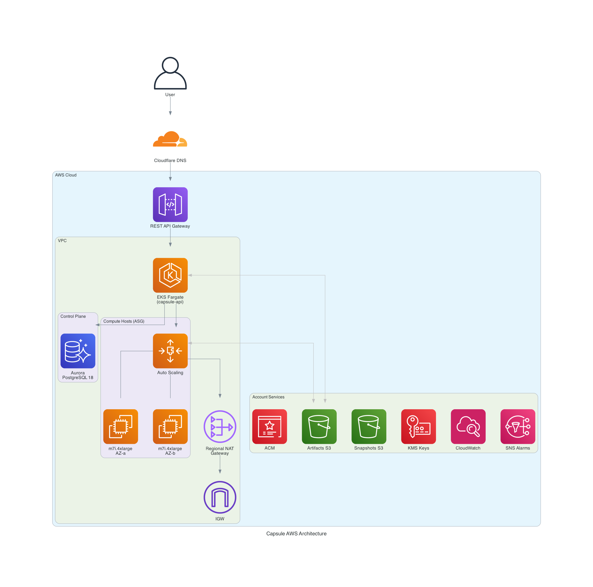

# Capsule AWS Infrastructure

This directory contains the multi-environment Terraform configuration for deploying Capsule on AWS.

## Architecture



```
User → REST API Gateway → VPC Link → NLB → EKS Fargate (API) → Aurora PostgreSQL
                                                   └→ Compute Host ASG (EC2)
```

To regenerate the diagram:

```bash
pip install diagrams
python infra/docs/diagrams/aws-architecture.py
```

### Staging on Production EKS

Staging reuses the production EKS cluster (discovered via `data.aws_eks_cluster`) with namespace `api-stg`. This saves ~$72/month but creates a coupling risk — a production EKS outage affects staging. For isolated staging, deploy a dedicated EKS cluster.

### Architecture Evolution

| Version | Control Plane | Entry Point |
|---|---|---|
| v1 (removed) | EC2 t3.medium ASG + ALB | Public ALB |
| v2 (removed) | ECS Fargate + ALB/NLB | API Gateway → VPC Link → NLB → ALB |
| v3 (current) | EKS Fargate + k8s Ingress/Service | API Gateway → VPC Link → NLB → EKS |
| v4 (future) | Cell-based: per-cell EKS + DB | API Gateway → Cell router → Cell |

### Future: Cell-Based Architecture

The current tiered architecture shares a single EKS cluster and Aurora instance across all compute hosts. For higher scale and fault isolation, upgrade to a cell-based model.

#### What Changes

```
Current:                      Cell-based (future):
┌── Shared EKS + Aurora ──┐   ┌── Cell A ──────────┐  ┌── Cell B ──────────┐
│   (one control plane)    │   │ capsule-api (EKS)  │  │ capsule-api (EKS)  │
└────────────┬─────────────┘   │ Aurora (replica)   │  │ Aurora (replica)   │
             │                 │ Compute Hosts × N  │  │ Compute Hosts × N  │
    ┌────────┼────────┐        └────────────────────┘  └────────────────────┘
    ▼        ▼        ▼                 ▲                       ▲
  Host A   Host B   Host C              └───────────┬───────────┘
                                              Cell Router (API GW or edge)
```

#### Key Design

| Layer | Current (tiered) | Cell-based (future) |
|---|---|---|
| **API** | One EKS cluster serves all | Per-cell EKS with capsule-api |
| **Database** | One Aurora writer | Aurora Global DB with per-cell read replicas + local write shard per cell |
| **Compute** | ASG spans AZs | Per-cell ASG (smaller, fault-isolated) |
| **Routing** | API Gateway → EKS directly | Cell router maps sandbox to cell, routes traffic |
| **Failure domain** | Control plane outage = global | Cell failure = only that cell's sandboxes |
| **Scaling** | Scale ASG vertically | Add cells horizontally |
| **Deployment** | One Terraform env per region | One Terraform env per cell |

#### Cell Router

Each sandbox is assigned to a cell at creation time. The cell router (a lightweight service or API Gateway routing rule) maps `sandbox-id → cell` and proxies traffic:

```
POST /v1/sandboxes          → cell router → least-loaded cell → create sandbox
GET  /v1/sandboxes/{id}     → cell router → sandbox's cell → status
WS   /v1/sandboxes/{id}/ws  → cell router → sandbox's cell → compute host
```

#### Migration Path (v3 → v4)

1. Deploy cell infrastructure module (`capsule-cell`) containing EKS + Aurora replica + Compute ASG
2. Run cells alongside existing shared control plane
3. Add cell router (lightweight EKS service with sandbox→cell registry)
4. Migrate sandboxes incrementally: new sandboxes placed in cells, existing ones stay on shared infra
5. Decommission shared control plane when all sandboxes migrated

## Structure

```
infra/
├── README.md
├── aws/
│   ├── modules/
│   │   ├── capsule-vpc/              # VPC, subnets, NAT, NACLs, endpoints, flow logs
│   │   ├── capsule-eks/              # EKS cluster, Fargate profile, ECR, IRSA
│   │   └── capsule-compute-host/     # EC2 ASG for Firecracker hosts
│   ├── production/                   # Production environment config
│   │   ├── backend.s3.hcl
│   │   ├── terraform.tfvars
│   │   └── ...
│   └── staging/                      # Staging environment config
│       ├── backend.s3.hcl
│       ├── terraform.tfvars
│       └── ...
└── docs/
    ├── diagrams/
    │   ├── aws-architecture.py          # Diagram-as-code source (diagrams library)
    │   └── aws-architecture.png         # Generated diagram
    ├── capsule-edge.md                  # Data plane architecture + deployment plan
    └── iam-permissions.md               # Terraform IAM permissions reference
```

Each environment directory is a standalone Terraform root module with its own state. The `capsule-vpc`, `capsule-eks`, and `capsule-compute-host` modules encapsulate shared resources. Aurora PostgreSQL, S3 buckets, KMS keys, and detective controls are per-environment and NOT part of the modules.

## Data Plane

`capsule-edge` is the session proxy for client-to-sandbox traffic (lease validation, WebSocket proxy, TLS termination). It is NOT yet deployed — see [docs/capsule-edge.md](docs/capsule-edge.md) for architecture and deployment plan.

## Environments

| Feature | Staging | Production |
|---|---|---|
| API runtime | EKS Fargate (256m CPU / 512 MiB) | EKS Fargate (256m CPU / 512 MiB) |
| API entry | REST API Gateway → VPC Link → NLB | REST API Gateway → VPC Link → NLB |
| API desired count | 1 | 2 |
| EKS cluster | Shared with production | Dedicated capsule-production |
| Compute host instance | `m7i-flex.large` (spot) | `m7i.4xlarge` (spot) |
| Compute ASG sizing | 1/1/3 | 1/1/9 |
| Database | Aurora Serverless v2 (0.5-4 ACU) | Aurora PostgreSQL 18 (2 instances) |
| NAT Gateway | Regional | Regional |
| VPC CIDR | `10.1.0.0/16` | `10.0.0.0/16` |

## Prerequisites

- Terraform 1.15 or newer
- AWS credentials with permission to manage VPC, EC2, IAM, ALB, ACM, SSM, and VPC Endpoints
- A Cloudflare-managed DNS zone for your domain
- A Cloudflare API token with `Zone:DNS:Edit` permission for that zone
- A Cloudflare R2 bucket for Terraform state (one bucket, separate key per environment)
- Cloudflare R2 access key credentials with read/write access to that bucket
- SecureString parameters in SSM Parameter Store for each environment

### SSM Parameters

Create per-environment parameters before applying:

```bash
# Production
aws ssm put-parameter --region us-east-1 --name /capsule/production/api-token --type SecureString --value 'change-me'
aws ssm put-parameter --region us-east-1 --name /capsule/production/github-deploy-key --type SecureString --value file://./capsule-production-deploy-key

# Staging
aws ssm put-parameter --region us-east-1 --name /capsule/staging/api-token --type SecureString --value 'change-me'
aws ssm put-parameter --region us-east-1 --name /capsule/staging/github-deploy-key --type SecureString --value file://./capsule-staging-deploy-key
```

### Cloudflare R2 Backend

Create a Cloudflare R2 API token with object read/write access. Store it in a separate AWS credentials profile:

```ini
[cloudflare-r2]
aws_access_key_id = <r2-access-key-id>
aws_secret_access_key = <r2-secret-access-key>
```

Copy the per-environment backend config and set your Cloudflare account ID:

```bash
cp infra/aws/production/backend.s3.hcl infra/aws/production/backend.r2.hcl
```

Edit the `backend.r2.hcl` per environment:

```hcl
bucket = "capsule-terraform-state"
key    = "aws/production/terraform.tfstate"
region = "auto"
profile = "cloudflare-r2"
shared_credentials_files = ["~/.aws/credentials"]
endpoints = {
  s3 = "https://<cloudflare-account-id>.r2.cloudflarestorage.com"
}
```

Note the state key path includes the environment name (`aws/production/` or `aws/staging/`) to avoid key collision.

## Usage

```bash
cd infra/aws/production  # or infra/aws/staging

# Initialize with backend config
terraform init -backend-config=backend.r2.hcl

# Create or migrate state
terraform init -backend-config=backend.r2.hcl -migrate-state

# Review the plan
terraform fmt && terraform validate && terraform plan

# Export Cloudflare API token (used by the provider, not stored in config)
export CLOUDFLARE_API_TOKEN='<your-token>'

# Apply
terraform apply
```

## Access

Use SSM Session Manager to connect to instances:

```bash
aws ssm start-session --region us-east-1 --target <instance-id>
```

Instances are placed in private subnets. Direct SSH requires additional routing (VPN, SSM port forwarding, or a jump host).

## Multi-Region

For low-latency sandbox access globally, deploy compute hosts and API servers in each region. Aurora Global Database keeps control-plane state consistent.

### Architecture

```
User → Cloudflare LB → nearest region:
                         ├── us-east-1 (US):     API GW → EKS → Aurora (primary) → Compute ASG
                         ├── eu-west-1 (EU):     API GW → EKS → Aurora (replica) → Compute ASG
                         └── ap-southeast-1 (SG): API GW → EKS → Aurora (replica) → Compute ASG
```

Sandboxes run on the nearest compute host to the user. The API routes sandbox creation requests to the region closest to the user, minimizing network latency for interactive sessions.

### Per-Region (full stack, same as current)

Each region gets its own environment directory with the complete stack:
- `infra/aws/us-east-1/` — US (primary, also hosts Aurora writer)
- `infra/aws/eu-west-1/` — EU (replica)
- `infra/aws/ap-southeast-1/` — Singapore (replica)
- Identical modules: VPC, **EKS Fargate**, **Compute Host ASG**, Aurora
- Separate Terraform state per region
- **Every region runs compute hosts** — sandboxes are placed in the user's nearest region

### Cross-Region Changes

| Component | Change |
|---|---|
| **DNS** | Cloudflare LB or Route 53 latency-based routing to nearest API Gateway |
| **Database** | Aurora Global Database — primary in one region, read replicas elsewhere |
| **ECR** | Cross-region replication for container images |
| **S3 (guest images)** | Cross-region replication or per-region buckets for data locality |
| **S3 (artifacts/snapshots)** | Per-region buckets (compute hosts need local access) |
| **TLS** | One ACM cert per region (API Gateway custom domain is regional) |
| **EKS** | One cluster per region (EKS is regional, not global) |
| **IRSA** | IAM roles per region (OIDC provider is per-cluster) |

### DNS Routing

```hcl
# Cloudflare Load Balancer
resource "cloudflare_load_balancer" "api" {
  zone_id = var.cloudflare_zone_id
  name    = "api.${var.domain_name}"
  pools   = [cloudflare_load_balancer_pool.us_east.id, cloudflare_load_balancer_pool.eu_west.id, cloudflare_load_balancer_pool.ap_southeast.id]
}

resource "cloudflare_load_balancer_pool" "us_east" {
  name    = "us-east"
  origins = [{ name = "us-east-1", address = module.us_east.api_gateway_domain, enabled = true }]
}

resource "cloudflare_load_balancer_pool" "eu_west" {
  name    = "eu-west"
  origins = [{ name = "eu-west-1", address = module.eu_west.api_gateway_domain, enabled = true }]
}

resource "cloudflare_load_balancer_pool" "ap_southeast" {
  name    = "ap-southeast"
  origins = [{ name = "ap-southeast-1", address = module.ap_southeast.api_gateway_domain, enabled = true }]
}
```

### Aurora Global Database

```hcl
resource "aws_rds_global_cluster" "main" {
  global_cluster_identifier = "capsule-global"
  source_db_cluster_arn     = module.us_east.aurora_cluster_arn  # primary in US
}

resource "aws_rds_cluster" "replica_eu" {
  # In eu-west-1
  global_cluster_identifier = aws_rds_global_cluster.main.id
  engine                    = "aurora-postgresql"
}

resource "aws_rds_cluster" "replica_sg" {
  # In ap-southeast-1
  global_cluster_identifier = aws_rds_global_cluster.main.id
  engine                    = "aurora-postgresql"
}
```

## Teardown

```bash
cd infra/aws/production  # or infra/aws/staging
terraform destroy
```
